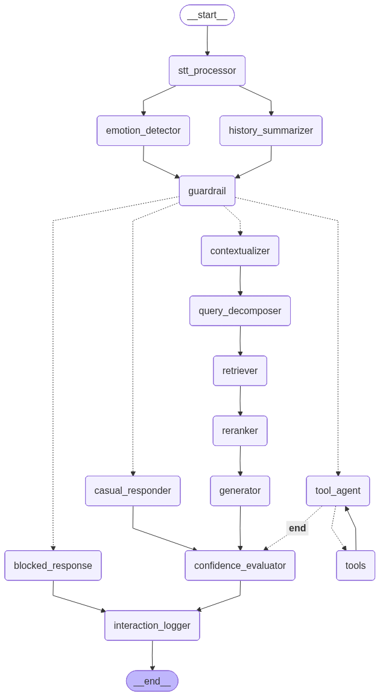
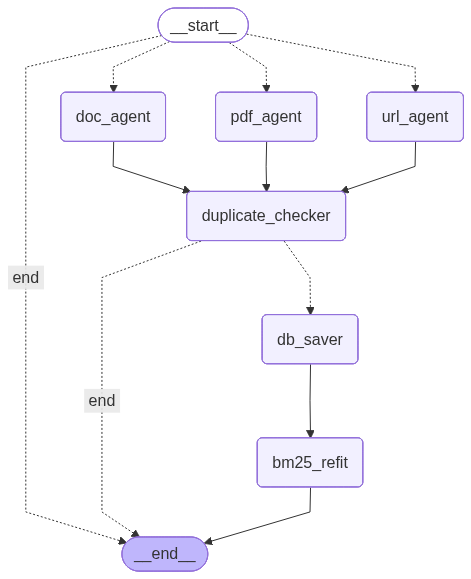
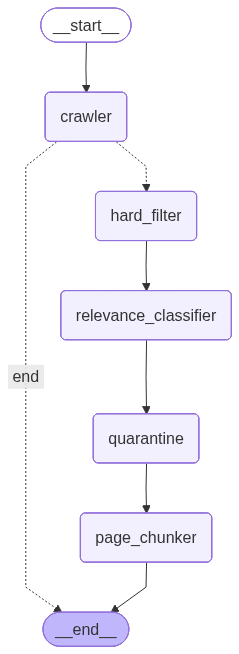

# Multi Agent RAG System

A Multi Agent Retrieval Augmented Generation (RAG) platform designed for customer support automation. This system leverages LangGraph for state orchestration, Pinecone for hybrid vector storage, and a suite of specialized agents to handle intent analysis, knowledge retrieval, and grounded response synthesis.

## 1. System Architecture Overview

The system is architected to perform deep semantic search with an RAG pipeline that transcends traditional simple vector lookups. It operates across three core functional domains, each powered by a custom LangGraph state machine.

### 1.1 RAG Internal Query Workflow
This is the primary execution path for user queries. It implements a multi-stage validation and retrieval cycle:
- Input Guardrails and PII Scrubbing.
- Query Decomposition into atomic sub-intents.
- Hybrid Semantic Search (Pinecone).
- Neural Reranking for context-prioritization.
- Final grounded generation using specialized LLM prompts.



### 1.2 Knowledge Ingestion Pipeline
Automated ingestion workflows transform static documentation into a dynamic search index:
- **Text Extraction**: High-fidelity processing of PDF, DOCX, and URL sources.
- **Semantic Chunking**: Intelligent splitting based on topic boundaries to preserve sentence-relationships.
- **Hybrid Indexing**: Syncing vectors to dense (relevance) and sparse (keyword) spaces.



### 1.3 Adaptive Web Scraping
An autonomous recovery agent that triggers when internal manuals fail to provide a definitive answer, ensuring zero-gap information coverage.



## 2. Specialized Agent Registry

| Agent Name | File Path | Core Responsibility |
| :--- | :--- | :--- |
| **Guardrail Agent** | `agents/guardrail.py` | Sanitization of inputs, safety checks, and Personal Identifiable Information (PII) preservation. |
| **Query Decomposer** | `agents/query_decomposer.py` | Breaks down complex, multi-part user questions into simple, searchable sub-queries for broader recall. |
| **Confidence Agent** | `agents/confidence_agent.py` | Evaluates the probability of an answer's correctness based on retrieved evidence before final output. |
| **Emotion Agent** | `agents/emotion_agent.py` | Sentiment analysis of user intent to adapt the tone and urgency of the system's generated response. |
| **Contextualizer** | `agents/contextualizer.py` | Re-writes queries to include chat history and missing entities, ensuring continuity in multi-turn conversations. |
| **Retriever Agent** | `agents/retriever.py` | Orchestrates hybrid search operations across the indexed knowledge base. |
| **Reranker Agent** | `agents/reranker.py` | Neural re-ranking of the top 20 retrieved chunks using a Cross-Encoder to select the top 5 most relevant. |
| **Generator Agent** | `agents/generator.py` | Synthesizes a coherent, human-like response grounded strictly in the provided evidence snippets. |
| **Summarizer Agent** | `agents/summarizer.py` | Concatenates and compresses large contexts or chat histories for more efficient LLM token usage. |
| **Finetuned LLM** | `agents/finetuned_llm_agent.py` | A specialized interface for custom-trained models optimized for telecom-specific terminology. |
| **PDF Ingestor** | `agents/pdf_ingestor.py` | Specialized text and metadata extraction handler for PDF documentation. |
| **Doc Ingestor** | `agents/doc_ingestor.py` | Handler for structured text extraction from Microsoft Word (`.docx`) file formats. |
| **URL Ingestor** | `agents/url_ingestor.py` | Dynamic content crawler for extracting text directly from web URLs for knowledge base population. |
| **Tool Agent** | `agents/tool_agent.py` | Management of external tool calls, including web scraping and real-time database lookups. |

## 3. RESTful API Blueprint

The service exposes a comprehensive FastAPI interface for frontend integration and administrative control.

| Endpoint Route | Primary Function | Data Handled |
| :--- | :--- | :--- |
| `/api/chat` | **Real-time Querying** | Accepts user messages, manages session history, and returns grounded RAG responses. |
| `/api/ingestion` | **Universal Document Loader** | Handles direct uploads of PDF/DOCX and URL-based content indexing. |
| `/api/knowledge` | **KB Management** | CRUD operations for managing the indexed knowledge base and checking document status. |
| `/api/handoff` | **Human Escalation** | Triggers and manages handoffs to human agents when confidence thresholds are not met. |
| `/api/feedback` | **RLHF Feedback** | Collects user ratings on generated responses to improve future model performance. |
| `/api/tools` | **External Operations** | Triggers auxiliary services like the autonomous web scraper or 3rd party databases. |
| `/api/health` | **System Reliability** | Standard health check heartbeats for monitoring API and vector DB connectivity. |

## 4. High-Precision Search Engine

### Hybrid Search Logic
Unlike standard vector search, the system employs **Hybrid Search** by combining:
1.  **Dense Vectors**: Semantic similarity capture using `sentence-transformers/all-MiniLM-L6-v2`. This enables finding meaning even when keywords do not match.
2.  **Sparse BM25 Vectors**: Keyword-exact matching using the `SparseEmbeddingManager`. This ensures specific terms (like error codes or device models) are handled with high precision.

### Neural Reranking
To overcome the "lost in the middle" problem of LLMs, we implement a second-stage **Neural Reranker**. 
- Initial search fetches the **Top 50** chunks.
- The `RerankerAgent` uses a **Cross-Encoder Model** to compare each chunk directly against the query.
- Only the **Top 5** highest-scoring chunks are passed to the Generator, significantly reducing hallucination risk.

## 5. Modular Plug-and-Play Tooling

The architecture is designed on a **Decoupled Tooling Protocol**. This "Plug-and-Play" nature ensures the system can bridge into any environment with minimal modification.

- **Interface Agnosticism**: Each specialized agent is a standalone module that can be pulled out of the LangGraph and used as a localized utility.
- **Dynamic Tool Injection**: The `ToolAgent` acts as a coordinator that can register and deregister new external tools (a new real-time database or API) without rewriting core RAG logic.
- **Cross-Component Extensibility**: Because agents communicate through standardized state dictionaries, a new agent (for specialized image analysis) can be inserted into the existing graph by simply updating the `graph/workflow.py` node definition.

## 6. Advanced Observability: Langfuse Integration

The system features production-grade observability through a deep-seated integration with **Langfuse**. This ensures full transparency and reliability for every state transition in the LangGraph.

- **Granular Tracing**: Every node execution in the multi-agent graph from initial guardrails to final generation is captured as a trace. Developers can inspect exact inputs/outputs of individual agents to diagnose "reasoning failures."
- **Centralized Prompt Management**: Prompts are not hardcoded but managed via the Langfuse Prompt Registry. This allows for A/B testing and version control without code re-deployment.
- **Cost and Usage Monitoring**: Automated token counting and pricing models provide real-time cost analysis for OpenAI (GPT-4), Groq (Llama), and other providers.
- **LLM-as-a-Judge Eval**: Automated evaluation templates analyze the "groundedness" and "relevance" of responses in production, feeding into a continuous quality dashboard.

## 7. Experimental and Developmental Trails

The development of this service was driven by data-centric experimentation, documented in the `/trails` directory. This ensures that every architectural decision (e.g., choice of chunking strategy or reranker) is backed by evidence.

| Trail Notebook | Objective |
| :--- | :--- |
| **01_data_ingestion_and_eda** | Exploration of raw manuals, identifying text density, and metadata patterns across PDFs and DOCX files. |
| **02_preprocessing_and_feature_engineering** | Validation of cleaning strategies and the impact of semantic chunking vs. recursive character splitting. |
| **03_baseline_models** | Initial performance testing of standard RAG using purely dense vectors before hybrid search was implemented. |
| **04_rag_evaluation** | Comprehensive benchmarking of retrieval precision (P@k, MRR) and the impact of the Neural Reranker. |
| **05_ablation_study** | Systematic testing to identify the contribution of specific components (e.g., impact of Removing BM25 or the Emotion Agent). |

## 8. Getting Started

Follow these steps to initialize and launch the Multi Agent RAG system:

### 8.1 Initialize Environment
The system uses `uv` for lightning-fast dependency management and project isolation. Ensure `uv` is installed and run:
```bash
uv sync
```

### 8.2 Launch the Backend API
Start the FastAPI server from the root directory:
```bash
uv run python api/main.py
```

### 8.3 Interactive API Documentation
Once the server is running, the interactive Swagger documentation is available at:
**[http://localhost:8000/docs](http://localhost:8000/docs)**

This provides a real-time sandbox to test every endpoint in the RESTful API Blueprint.

## 9. Deployment Configuration

The following environment variables are required for operational readiness:

```env
PINECONE_API_KEY=xxx
OPENAI_API_KEY=xxx
GROQ_API_KEY=xxx
LANGFUSE_PUBLIC_KEY=xxx
LANGFUSE_SECRET_KEY=xxx
LANGFUSE_HOST=https://cloud.langfuse.com
```

---
**Done by Danula Rathnayaka**